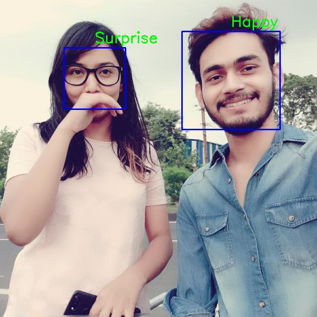
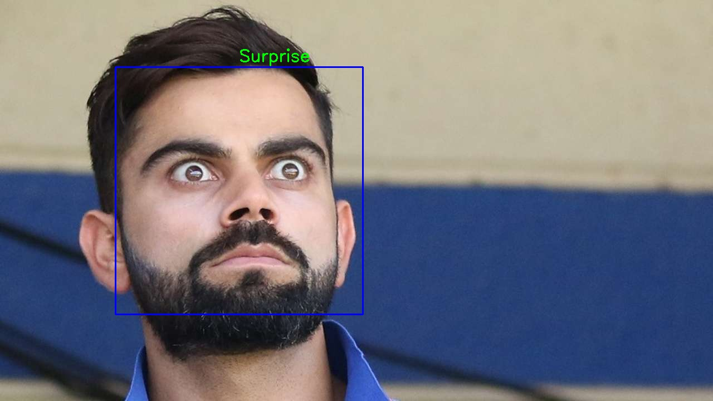
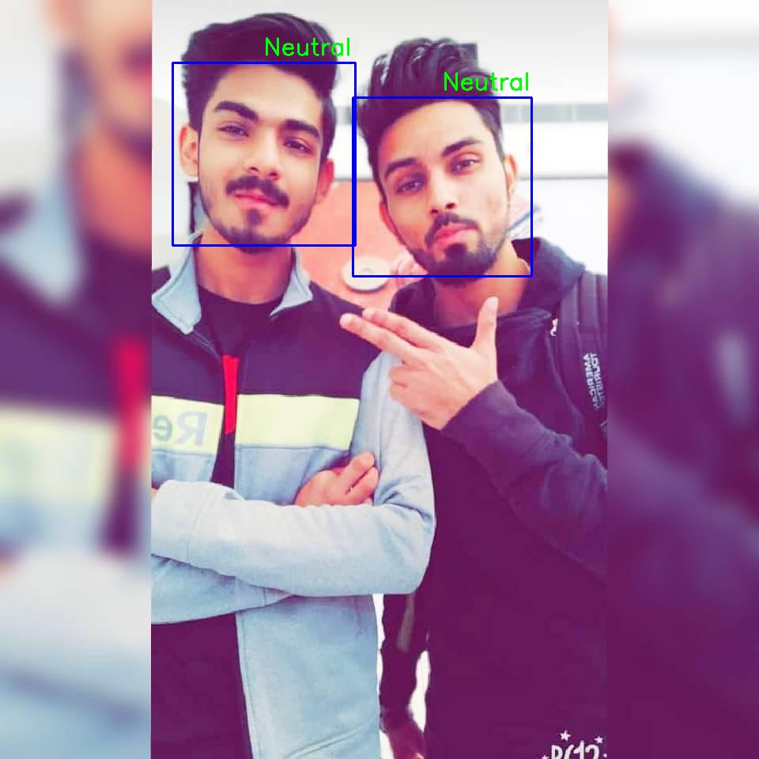
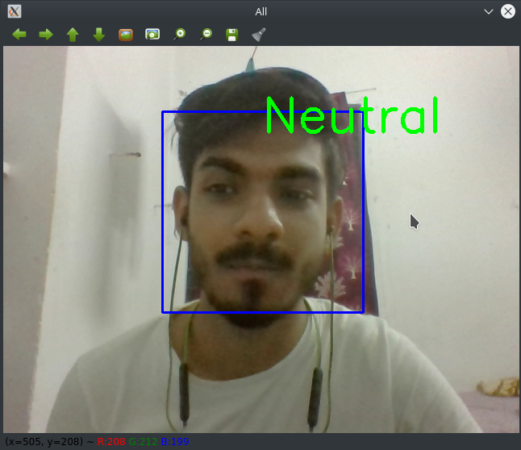
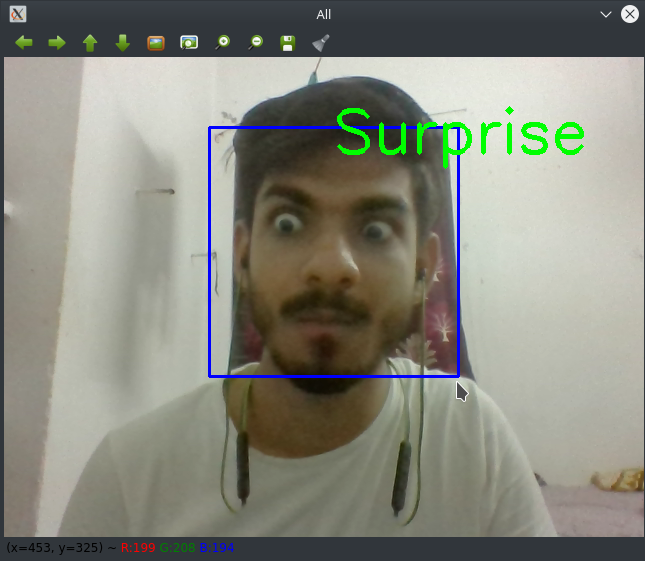

# Deep-learning-Projects
This repository contains various deep learning models with details of each model mentioned in index.md file as well as in the code of each model.
# Images of the Facial Emotion Detector 
 |  | 
 |  | 
